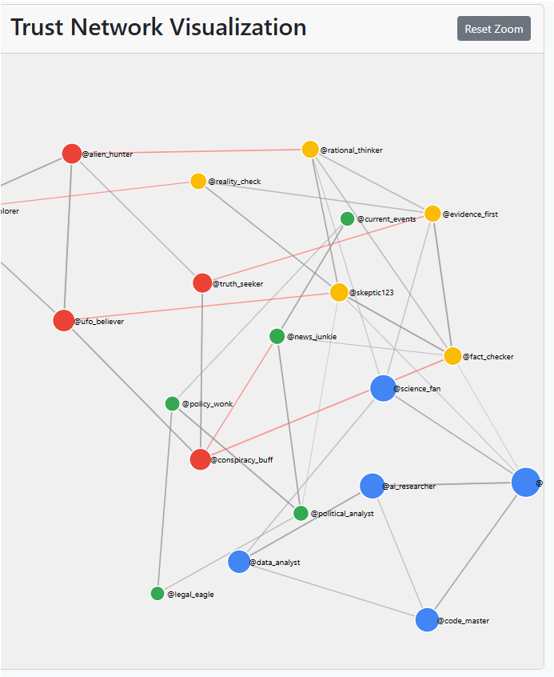

# Twitter Trust System



## System Updates
### Manual Update
Run the update script in powershell:
```
.\update_trust_system.ps1
```

### Scheduled Automatic Updates
The system can be configured to run automatically using Windows Task Scheduler:
```
.\schedule_task.ps1
```
This will register a Windows Scheduled Task that runs every 10 minutes (default) using parameters defined in `config.json`.

## Configuration
The system's behavior can be customized through the `config.json` file:

```json
{
  "update_frequency_minutes": 10,
  "tweet_lookback_minutes": 60,
  "rating_range": {
    "min": -100,
    "max": 100
  },
  "sybil_detection": {
    "enabled": true,
    "similarity_threshold": 0.9,
    "suspicious_ratio": 5
  },
  "temporal_decay": {
    "enabled": true,
    "half_life_days": 90,
    "decay_factor": 0.5
  }
}
```

## Overview
This project implements an eigenvector-based reputation system for Twitter users. The system allows users to assign trust ratings to other users (from -100 to +100), creating a network of trust relationships. Trust scores are calculated using a PageRank-like algorithm, where a user's reputation depends on both how much trust they receive and the trustworthiness of those who trust them.

## Concept

The core ideas behind this system are:

1. **Normalized Trust Assignments**: Each user can assign ratings from -100 to +100, which are normalized to ensure fair influence (using L2 normalization)
2. **Weighted Influence**: A user's trust assignment carries weight proportional to their own trustworthiness
3. **Trust Propagation**: Trust flows through the network recursively (similar to PageRank)
4. **Community Structure**: The system naturally allows communities to form around shared interests
5. **Sybil Resistance**: The system is designed to resist manipulation through fake accounts

## Implementation

The system collects trust assignments from Twitter and calculates trust scores. Key components include:

### Trust Assignment
Users assign trust ratings to others by tweeting with the trustrank hashtag:
```
#trustrank @username +70
```
or
```
#trustrank @username -30
```

### Trust Calculation
Trust scores are calculated using an eigenvector-based approach similar to PageRank:
1. Trust ratings are normalized using L2 normalization (vector length = 1) to prevent any single user from dominating
2. Positive and negative trust are processed separately (negative trust acts as a penalty)
3. PageRank algorithm with appropriate damping factor is applied to find each user's global trust score
4. Distrust penalties are applied using a tanh function to implement diminishing returns

### User Commands
The system supports Twitter commands in the format:
- `#trustrank @username +70` - Assign positive trust points
- `#trustrank @username -30` - Assign negative trust points (distrust)

## File Structure
The project is organized into the following files:

```
twitter-trust-system/
├── update_trust_system.ps1     # Manual update script
├── schedule_task.ps1           # Task scheduler script
├── config.json                 # System configuration
├── trust_assignments.json      # User trust assignments
├── scripts/
│   ├── collect_trust.py        # Collects trust assignments from Twitter
│   └── calculate_trust.py      # Calculates trust scores
├── logs/
│   ├── twitter_collection.log  # Collection log
│   └── trust_calculation.log   # Calculation log
└── js/
    └── data.js                 # Generated data for visualization
```

## Logging & Monitoring
The system maintains detailed logs to track operations and detect issues:

- **Collection Log**: `twitter_collection.log` records Twitter API interactions and trust assignments collected
- **Calculation Log**: `trust_calculation.log` documents the trust calculation process
- **Update Log**: `latest_update.log` shows when the system was last updated

Log format example:
```
[2025-05-11 14:32:15] Starting Twitter Trust System update process...
[2025-05-11 14:32:18] Retrieved 247 new tweets
[2025-05-11 14:32:45] Found 56 trust assignments
[2025-05-11 14:33:02] Trust scores updated for 124 users
```

### Sybil Attack Resistance
The system has several features that help resist manipulation:
- Trust only flows significantly through established users
- L2 normalization prevents any single user from having outsized influence
- The recursive nature of PageRank requires attackers to first gain trust from already-trusted nodes

## Visualization
The web interface shows the trust network with:
- Node size representing trust score
- Edge width representing trust amount
- Colors representing different communities detected by the Louvain algorithm

## Community Analysis
The system identifies natural communities and analyzes trust flow between them:
- Groups users by shared trust patterns
- Uses the Louvain method for community detection
- Displays communities with distinct colors in the visualization

## Critical Assessment
Evaluating this trust system against cutting-edge trust metrics research reveals several strengths and limitations:

### Strengths
- **Eigenvector-Based Approach**: The PageRank-like algorithm correctly implements a recursive trust model, which aligns with research showing that trust should be propagated based on the trustworthiness of sources.
- **Distrust Handling**: The implementation separates positive and negative trust and applies penalties using a tanh function, creating diminishing returns for excessive distrust.
- **Community Detection**: Using the Louvain method to identify natural communities in the trust network aligns with research showing that trust tends to cluster.
- **Normalization**: The L2 normalization of each user's ratings helps prevent manipulation by limiting any individual's influence.
- **Time-Aware Collection**: Tracking tweet timestamps and only processing new content is efficient and reduces unnecessary API calls.

### Limitations
- **Limited Context Awareness**: The system treats all trust ratings equally regardless of domain/context. Current research emphasizes that trust is highly contextual - you might trust someone about politics but not medicine.
- **Simplistic Attack Resistance**: While normalization helps, the system lacks more sophisticated Sybil attack detection. Advanced trust systems use techniques like SybilGuard or incorporate network flow constraints.
- **No Confidence Measures**: The system doesn't distinguish between trust based on many interactions versus few. Research in subjective logic suggests trust should include uncertainty measurements.
- **Static Trust Decay**: Trust statements remain equally weighted regardless of age. Modern trust systems incorporate temporal decay to give more weight to recent interactions.
- **Limited Feedback Loop**: There's no mechanism for evaluating trust accuracy over time. Advanced systems incorporate reputation feedback to adjust trust based on actual outcomes.
- **Centralized Structure**: The implemented system relies on a central authority to calculate trust, unlike newer decentralized approaches like those used in blockchain-based reputation systems.

### Alignment with Original Goals
The system successfully implements the core concepts we aimed for:
- A Twitter-based approach to collect trust statements (✓)
- A network-based calculation that considers transitive trust (✓)
- A visualization that shows community structure (✓)
- Reasonable attack resistance (✓)

However, it falls short on:
- Advanced Sybil resistance (partial)
- Topic-specific trust (not implemented)
- Trust evolution over time (minimal)

## Research-Driven Improvement Ideas

| Improvement | Description | Significance | Difficulty | Priority |
|-------------|-------------|-------------|------------|----------|
| Distrust-Aware Community Detection | Modify community detection to account for negative relationships, ensuring people who distrust each other are placed in different communities | ⭐⭐⭐⭐⭐<br>Dramatically improves community accuracy, especially for polarized topics | 🔷🔷<br>Medium - requires implementing a signed graph algorithm | High |
| Temporal Trust Decay | Make older trust statements less influential over time, giving more weight to recent opinions | ⭐⭐⭐⭐<br>Allows the system to adapt to changing relationships and opinions | 🔷<br>Low - simply add a decay factor based on timestamp | High |
| Topic-Specific Trust | Detect topics in tweets and maintain separate trust scores for different domains | ⭐⭐⭐⭐⭐<br>Recognizes that trust is contextual - you might trust someone about tech but not politics | 🔷🔷🔷🔷<br>High - requires topic detection and multiple trust graphs | Medium |
| Sybil Attack Detection | Implement more sophisticated methods to detect and mitigate fake accounts trying to manipulate trust scores | ⭐⭐⭐⭐<br>Protects system integrity from coordinated manipulation | 🔷🔷🔷<br>Medium-High - requires pattern recognition in network structure | High |
| Trust with Uncertainty | Add confidence measures to each trust rating based on interaction history | ⭐⭐⭐<br>Distinguishes between well-established trust and tentative trust | 🔷🔷<br>Medium - requires tracking additional metrics | Medium |
| Expertise Inference | Infer user expertise in specific domains from their content and behavior | ⭐⭐⭐<br>Helps weight trust by demonstrated expertise | 🔷🔷🔷🔷<br>High - requires NLP and behavior analysis | Low |
| Flow Constraint Trust | Implement max-flow constraints similar to Advogato's trust metric | ⭐⭐⭐⭐<br>Provides stronger resistance to manipulation | 🔷🔷🔷<br>Medium-High - requires implementing flow algorithms | Medium |
| Trust Visualization Improvements | Enhanced interactive visualizations showing trust flow, community boundaries, and historical changes | ⭐⭐⭐<br>Improves user understanding of the trust landscape | 🔷🔷<br>Medium - requires D3.js refinements | Low |
| Feedback Loop | Track outcomes of trusting relationships and adjust weights based on accuracy | ⭐⭐⭐⭐<br>Creates a self-correcting system that improves over time | 🔷🔷🔷🔷<br>High - requires defining and tracking trust outcomes | Low |
| Decentralized Calculation | Move to a distributed approach where trust calculations happen locally | ⭐⭐<br>Improved privacy and resilience | 🔷🔷🔷🔷🔷<br>Very High - requires complete architecture change | Low |

## Advanced Modules (Optional)

### Distrust-Aware Community Detection

An improved approach would use distrust as a force pushing users into different communities:

```python
# Create a signed graph for community detection
G_signed = nx.DiGraph()
for i in range(n_users):
    G_signed.add_node(i)

# Add all trust relationships (both positive and negative)
for i in range(n_users):
    for j in range(n_users):
        if trust_matrix[i, j] != 0:
            # Use the sign of the trust value to indicate trust/distrust
            G_signed.add_edge(i, j, weight=trust_matrix[i, j], sign=np.sign(trust_matrix[i, j]))

# Use a signed community detection algorithm
from sklearn.cluster import SpectralClustering
import scipy.sparse as sp

def signed_community_detection(trust_matrix):
    # Create a signed adjacency matrix
    n = trust_matrix.shape[0]
    
    # Convert to a similarity matrix for spectral clustering
    # Positive values indicate similarity, negative values indicate dissimilarity
    similarity = trust_matrix.copy()
    
    # Apply spectral clustering
    clustering = SpectralClustering(
        n_clusters=min(8, n),  # Auto-determine community count
        affinity='precomputed',
        random_state=0
    ).fit(similarity)
    
    return clustering.labels_
```

### Temporal Trust Decay

```python
# Implementation approach:
# Modify the trust calculation to include time decay
def apply_time_decay(trust_assignments, decay_factor=0.5, half_life_days=90):
    current_time = datetime.now()
    decayed_assignments = {}
    
    for source, targets in trust_assignments.items():
        decayed_assignments[source] = {}
        for target, value_info in targets.items():
            value = value_info["value"]
            timestamp = dateutil.parser.parse(value_info["timestamp"])
            
            # Calculate age in days
            age_days = (current_time - timestamp).days
            
            # Apply exponential decay
            decay = math.pow(decay_factor, age_days / half_life_days)
            decayed_value = value * decay
            
            decayed_assignments[source][target] = decayed_value
    
    return decayed_assignments
```

## Future Enhancements
Additional improvements to the system:

1. **Topic-Specific Trust**: Allow trust assignments specific to different topics
2. **Integration with Activity Metrics**: Factor in user activity and engagement patterns
3. **Trust Recommendations**: Suggest trust redistributions based on network analysis
4. **Advanced Attack Resistance**: Implement more sophisticated Sybil-detection algorithms

## Related Concepts
This implementation draws inspiration from:
- PageRank algorithm
- EigenTrust system for P2P networks
- Advogato's Trust Metric
- Web of Trust systems

## Limitations
Current limitations of the system include:
- Computational complexity for large networks
- Cold start problem for new users
- Potential for polarization and echo chambers
- Privacy considerations around publicly visible trust relationships

## Implementation Strategy for Twitter
To implement this on Twitter, the best approach would be:
1. Start with a bot that accepts trust commands via mentions/DMs
2. Maintain a database of trust assignments
3. Periodically calculate and update trust scores
4. Provide UI for users to check scores and get recommendations

This would allow for a practical implementation without requiring changes to Twitter's core platform.